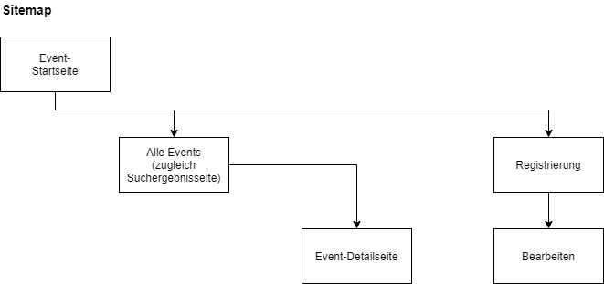
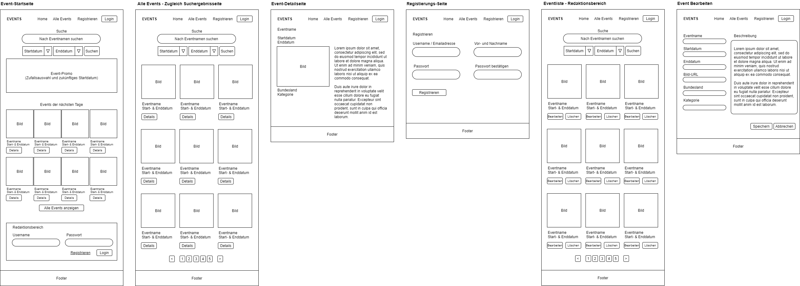
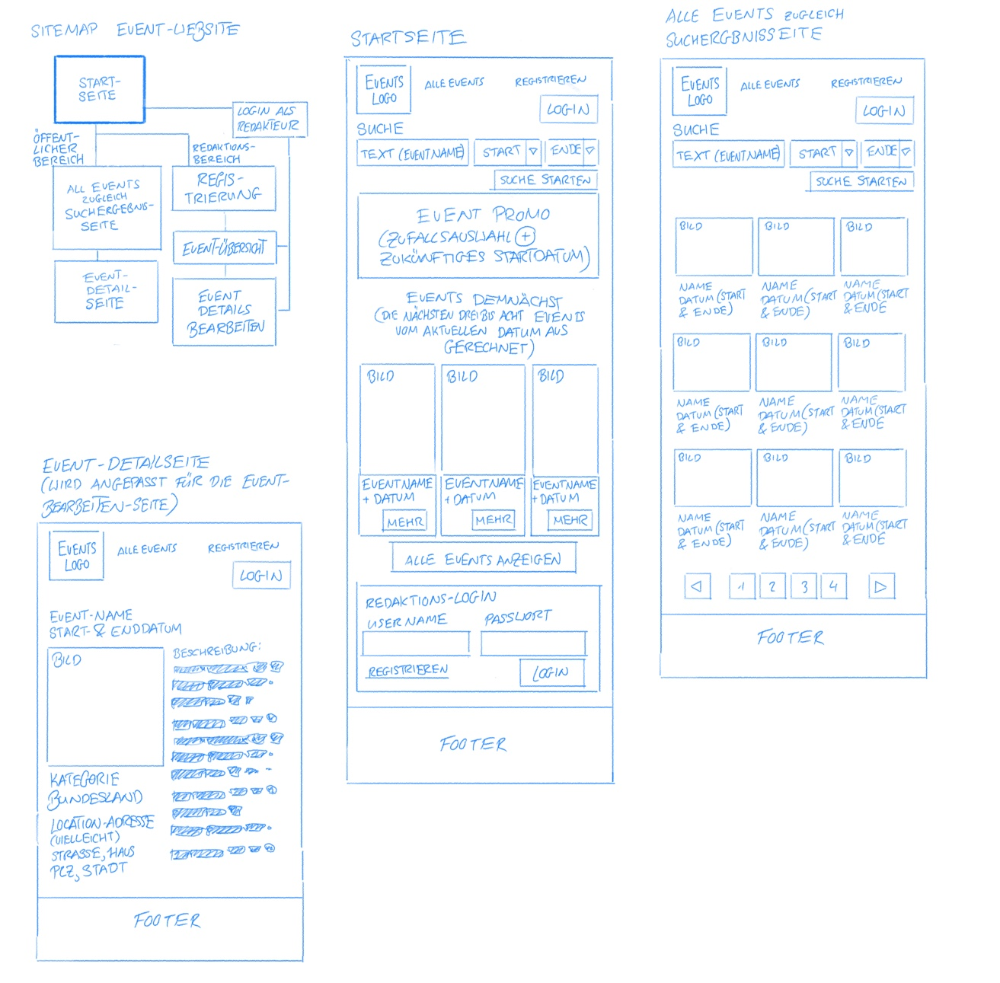

# Event Mini-Projekt
von Marin Balabanov

Ziel dieses Projekts ist die Implementierung einer einfachen Event-Plattform. Events haben folgende Felder:
- ein Titel
- ein Startdatum
- falls notwendig ein Enddatum (z.B. bei mehrtägigen Festivals)
- ein Bundesland
- ein Bild (URL)
- eine Beschreibung
- und eine Kategorie (z.B. Ausstellung, Musikkonzert, Oper, usw.)

## Sitemap

## Wireframes

## Konzept
