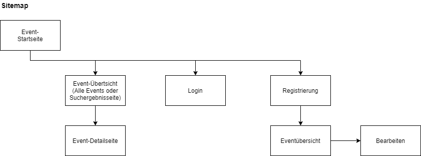
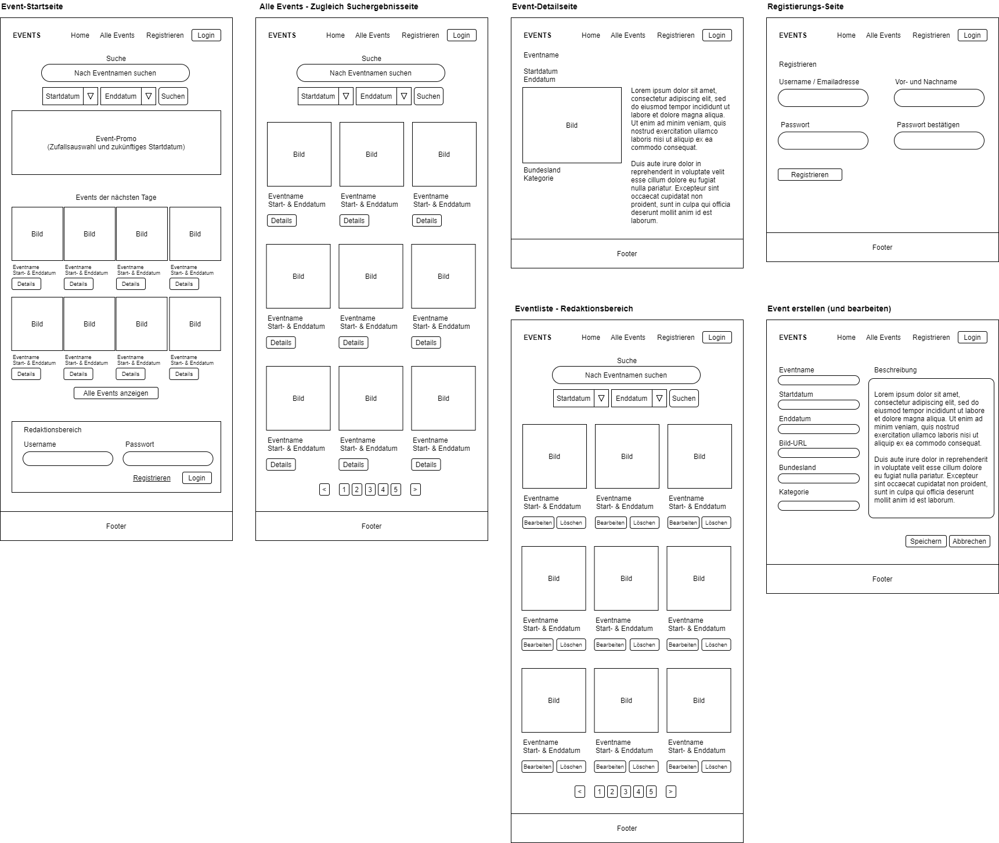

# Event Mini-Projekt

Dies ist eine Mini-Projekt mit einem kleinen Event-Kalender in PHP entwickelt und mit Styling mit Bootstrap.

Ziel dieses Projekts ist die Implementierung einer einfachen Event-Plattform. Events haben folgende Felder:
- ein Titel
- ein Startdatum
- falls notwendig ein Enddatum (z.B. bei mehrtägigen Festivals)
- ein Bundesland
- ein Bild (URL)
- eine Beschreibung
- und eine Kategorie (z.B. Ausstellung, Musikkonzert, Oper, usw.)

## Sitemap

## Wireframes

## Konzept

## Beispieldaten
Im Verzeichnis `data` befindet sich die exportierte DB-Tabelle `event` mit Beispieldaten. Importieren Sie diese Tabelle in Ihre Datenbank und passen Sie die Einstellungen in der Include-Datei `include_db.php` an.